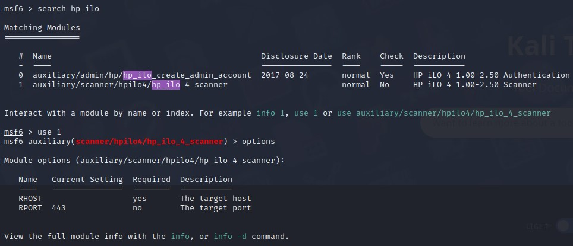

# Module hp_ilo_4_scanner
This module checks if the provided host is vulnerable to an authentication bypass in HP iLO 4 1.00 to 2.50.

# How to use it

On your kali host do:

```
# create a directory in the modules
sudo mkdir /usr/share/metasploit-framework/modules/auxiliary/scanner/hpilo4

# copy the module
sudo cp hp_ilo_4_scanner.rb /usr/share/metasploit-framework/modules/auxiliary/scanner/hpilo4/

# open msfconsole and update the database
reload_all
```

You can now use it as all the other modules.

## Preview



# ToDo
Commit this to the official metasploit framework repo